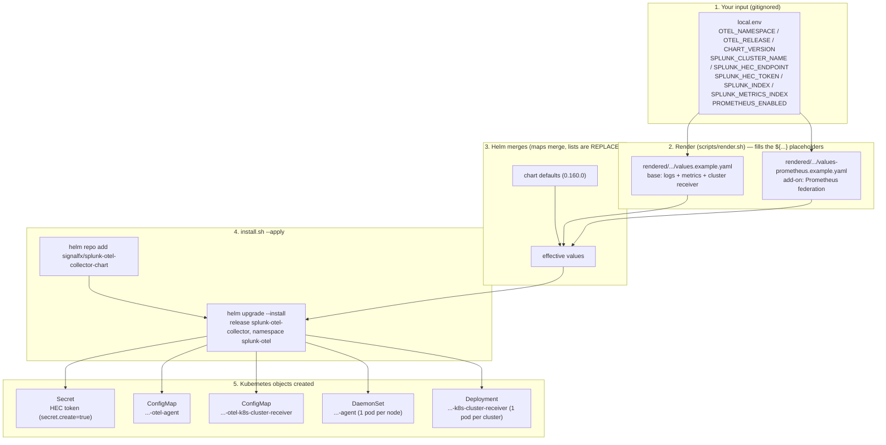
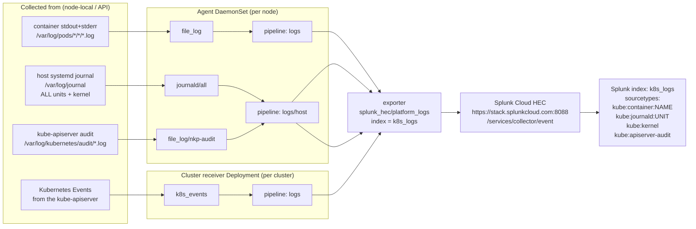
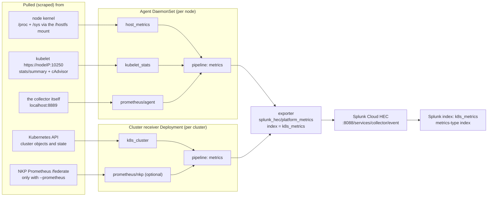
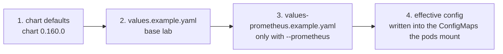
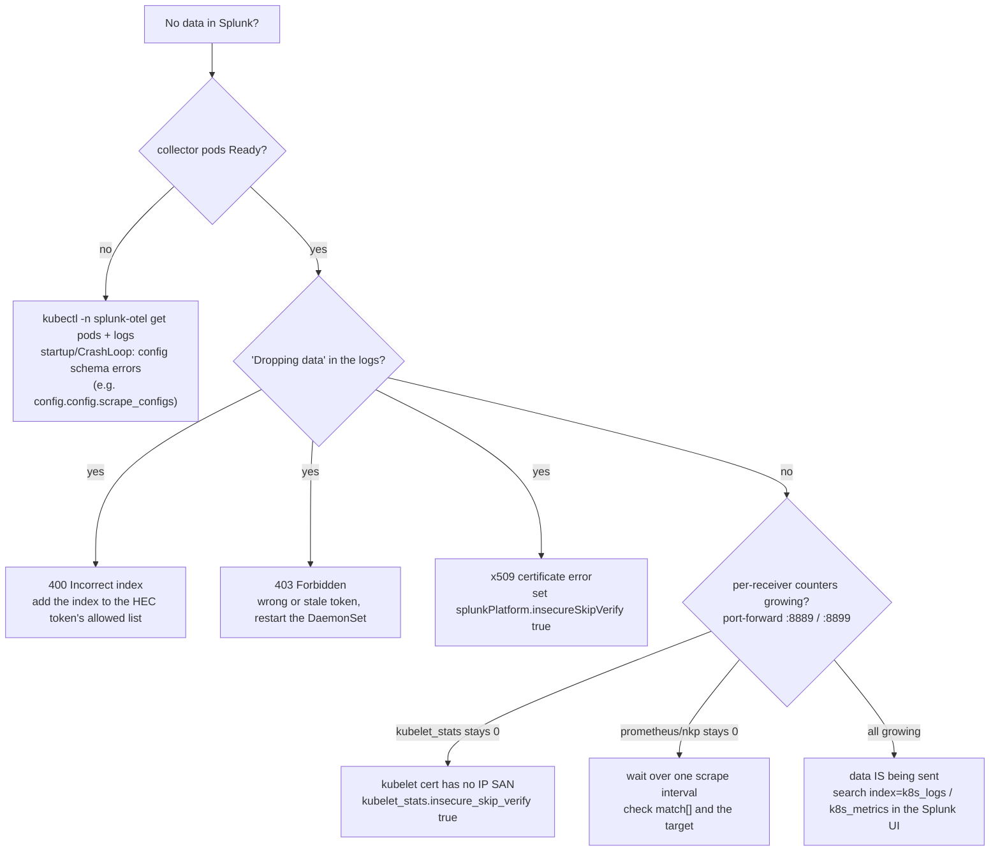

# Lab 08 — diagrams: install, configure, collect, send

One page to *see* how the Splunk OpenTelemetry Collector is put together. Everything here matches the
values in this lab (chart `splunk-otel-collector` 0.160.0).

> Mermaid renders automatically on GitHub (and in the VS Code Markdown preview). If you read this in a
> plain terminal you will just see the code blocks — open it on GitHub to see the diagrams.

---

## 1. Install and configure — from `local.env` to running pods

`--prometheus` is the only switch that adds the second values file; without it the collector never
touches Prometheus.

---

## 2. Logs — where they are collected from and where they are sent

---

## 3. Metrics — where they are pulled from and where they are sent

---

## 4. Which value wins — configuration precedence

Later wins. Helm merges maps deeply but **replaces lists**, which is why the Prometheus fragment must
repeat `k8s_cluster` in the `metrics` pipeline, and why the `logs/host` pipeline must list both receivers.

`local.env` is not a layer of its own — `render.sh` substitutes its values **into** file 2 (and 3)
before Helm ever sees them.

---

## 5. Troubleshooting flow — "nothing is showing up in Splunk"

The two questions that catch almost everything: **are the pods Ready?**, and **do the per-receiver
counters grow?** ("no drops" alone does not mean healthy — a receiver that fails to *scrape* emits
nothing and drops nothing).

---

## See also

- [`README.md`](README.md) — the step-by-step lab, the values with WHY, and the troubleshooting matrix.
- [`values.example.yaml`](values.example.yaml) — every value documented (WHAT/DEFAULT/OURS/WHY/BREAKS).
- [`values-prometheus.example.yaml`](values-prometheus.example.yaml) — the Prometheus federation add-on.
