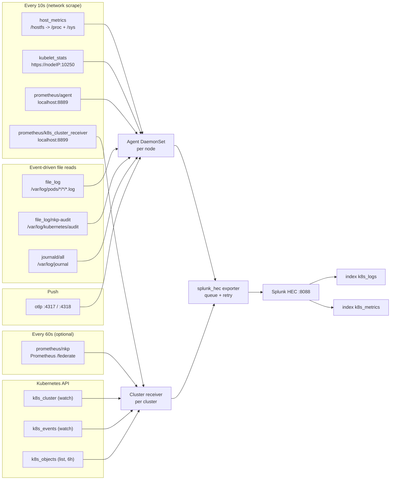

# Operating model — what the collector pulls, and how

This page is the "under the hood" view of the lab's collector: **what it talks to, on what timer, with
what credentials, and what it produces**. Everything below is taken from the config that the chart
actually rendered on the lab (`kubectl -n splunk-otel get cm … -o jsonpath='{.data.relay}'`), not from
theory.

---

## 1. The mental model in one paragraph

The collector is **pull-first**. Almost everything it ships is **fetched on a timer** by a *receiver*
(a scrape); only OTLP is pushed *to* it. Each receiver produces telemetry that flows through
*processors* and out through an *exporter* along a *pipeline*. It runs as **two workloads**: a
**DaemonSet agent** (one pod per node) that pulls **node-local** things, and a **Deployment cluster
receiver** (one pod per cluster) that pulls **cluster-wide** things from the Kubernetes API.

```
pull source ──► receiver ──► processors (memory_limiter, k8s_attributes, batch, …) ──► exporter ──► Splunk HEC
   (timer)                                                                             splunk_hec
```

## 2. There are three *kinds* of "pull"

| Kind | How it works | Which receivers |
|---|---|---|
| **File tail** | read local files / the journal socket, remember the read offset, emit new lines | `file_log`, `file_log/nkp-audit`, `journald/all` |
| **Network scrape** | HTTP GET a metrics endpoint on a timer | `host_metrics`, `kubelet_stats`, `prometheus/agent`, `prometheus/k8s_cluster_receiver`, `prometheus/nkp` |
| **API watch / list** | talk to the Kubernetes API server (a streaming watch, or a periodic list) | `k8s_cluster`, `k8s_events`, `k8s_objects` |

...plus **push**: `otlp` accepts data sent *to* the collector.

## 3. Why two workloads

| | Agent (DaemonSet) | Cluster receiver (Deployment) |
|---|---|---|
| Replicas | **one pod per node** | **one pod per cluster** |
| Why | its sources are **node-local** (that node's logs, kernel, journal, kubelet) | its source is the **Kubernetes API**, which is cluster-wide — one pod sees everything, per-node pods would duplicate |
| Runs | 7 pods on `dc1-nkp-cl01` | 1 pod |

The agent runs with `hostNetwork: true`, which is how it reaches the node's kubelet at
`https://<nodeIP>:10250`.

---

## 4. What each receiver pulls (the table)

### Agent (DaemonSet, per node)

| Receiver | Mode | Pulls from | Auth | Interval | Produces |
|---|---|---|---|---|---|
| `file_log` | file tail | `/var/log/pods/*/*/*.log` (CRI/docker aware; `container` parser + docker recombine) | local files | event-driven | container stdout/stderr logs |
| `file_log/nkp-audit` | file tail | `/var/log/kubernetes/audit/*.log` | local files | event-driven | kube-apiserver audit events |
| `journald/all` | file/socket read | `/var/log/journal` (ALL units + kernel) | local | event-driven | host logs (`kube:journald:*`, `kube:kernel`) |
| `host_metrics` | network scrape (local) | the **node kernel** via `root_path: /hostfs` → `/proc`, `/sys` | none (local) | **10s** | node CPU, memory, disk I/O, filesystem, load, network, paging, processes |
| `kubelet_stats` | network scrape | `https://${K8S_NODE_IP}:10250/stats/summary` (+ cAdvisor) | **service account token** | **10s** | pod/container/node usage (`k8s.pod.*`, `k8s.container.*`, `k8s.node.*`) |
| `prometheus/agent` | network scrape | `localhost:8889` (the collector's own telemetry) | none | **10s** | `otelcol_*` self-metrics |
| `otlp` | **push** | `0.0.0.0:4317` (gRPC) + `0.0.0.0:4318` (HTTP) | none | n/a | whatever apps send |
| `receiver_creator` | inert | — (`receivers: null`, only watches `k8s_observer`) | — | — | nothing (discovery hook, unused) |

`host_metrics` scrapers: `cpu`, `disk`, `filesystem` (only mount `/`), `load`, `memory`, `network`,
`paging`, `processes`.

`kubelet_stats` has `metric_groups: [container, pod, node]`, `extra_metadata_labels: [container.id]`,
and `insecure_skip_verify: true` (the kubelet certificate has no IP SAN — see the lab README).

### Cluster receiver (Deployment, per cluster)

| Receiver | Mode | Pulls from | Auth | Interval | Produces |
|---|---|---|---|---|---|
| `k8s_cluster` | API watch | the **Kubernetes API** for cluster-scoped objects | service account | continuous | node/pod/deployment/daemonset/statefulset/namespace/cluster metrics |
| `k8s_events` | API watch | Kubernetes **Events** | service account | continuous | Events as **logs** |
| `k8s_objects` | API list | `pods`, `networkpolicies`, `customresourcedefinitions` | service account | **every 6h** | objects as **logs** |
| `prometheus/k8s_cluster_receiver` | network scrape | `localhost:8899` (its own telemetry) | none | **10s** | `otelcol_*` self-metrics |
| `prometheus/nkp` *(optional)* | network scrape | NKP's Prometheus `/federate` | none (in-cluster HTTP) | **60s** | everything Prometheus holds per the `match[]` selector |

## 5. What happens between pull and send (processors)

Receivers hand records to processors, in this order (agent pipelines):

| Processor | What it does | Why it matters |
|---|---|---|
| `memory_limiter` | checks every `2s`; refuses data above the memory ceiling | the ceiling tracks `agent.resources.limits.memory` (the chart feeds the pod's memory limit into the collector) — protects the node |
| `k8s_attributes` | adds Kubernetes metadata (`k8s.namespace.name`, `k8s.pod.name`, `k8s.node.name`, `container.id`, …) and reads **`splunk.com/*` annotations** for `index`, `sourcetype`, `exclude` | this is how a pod can ask for its own index/sourcetype |
| `filter/logs` | drops records whose namespace/pod carries `splunk.com/exclude=true` | opt-out per workload |
| `batch` | groups records before export | fewer, larger HEC requests |
| `resource_detection` | runs the `env` and `system` detectors | fills `host.name` etc. |
| `resource/add_agent_k8s` | adds cluster/pod resource attributes | gives every record `k8s.cluster.name` |

The **logs/host** pipeline uses a shorter chain (`memory_limiter → batch → resource_detection →
resource`) because journal/audit records already carry `host.name` and `com.splunk.*` from the
receiver operators.

## 6. How it is sent (exporter) and the delivery guarantees

Both `splunk_hec/platform_logs` and `splunk_hec/platform_metrics` are configured as:

| Setting | Value | Meaning |
|---|---|---|
| `endpoint` | `https://<stack>.splunkcloud.com:8088/services/collector/event` | the HEC door |
| `index` | `k8s_logs` / `k8s_metrics` | per-exporter index |
| `token` | `${SPLUNK_PLATFORM_HEC_TOKEN}` | injected from the chart-managed Secret (never in git) |
| `tls.insecure_skip_verify` | `true` | the Cloud HEC cert is `SplunkCommonCA` (not publicly trusted) |
| `sending_queue` | enabled, `queue_size: 1000`, `10` consumers | buffers during HEC hiccups |
| `retry_on_failure` | `5s → 30s`, `max_elapsed_time: 300s` | retries 5xx/network errors for up to 5 min |
| `disable_compression` | `false` | gzip on the wire |
| `timeout` | `10s` | per-request timeout |

So a short HEC outage is absorbed by the queue/retry; a permanent error (wrong index, bad token) is
**not** retried forever — those records are dropped and counted (`Dropping data` in the logs).

## 7. Checkpointing / restart behaviour

- `file_storage` (extension) checkpoints at `/var/addon/splunk/otel_pos` — the journal (and container
  log) read offsets survive a pod restart, so a restart does not re-send or skip entries.
- Config changes roll the pods automatically (the chart puts a checksum of the config on the pod
  template) — **except** env-var changes like the HEC token, which need
  `kubectl rollout restart ds/<release>-agent`.

## 8. Timers at a glance

```
10s  host_metrics · kubelet_stats · prometheus/agent · prometheus/k8s_cluster_receiver
60s  prometheus/nkp (federate)         <- only with --prometheus
6h   k8s_objects (pods/networkpolicies/CRDs)
--   file tails (file_log, audit, journald) and k8s_cluster/k8s_events watches: event-driven
```

Everything on a timer writes **one datapoint per series per scrape** — that is why shortening
`prometheus/nkp`'s interval multiplies Splunk metrics volume.

## 9. Ports and endpoints (operational reference)

| Where | Port | What |
|---|---|---|
| agent | `8889` | the collector's own metrics (`/metrics`) — port-forward to inspect receivers |
| agent | `13133` | health check |
| agent | `4317` / `4318` | OTLP in (gRPC / HTTP) for apps that push |
| agent | `55679` | `zpages` (in-process debug UI) |
| cluster receiver | `8899` | its own metrics |
| cluster receiver | `13134` | health check |
| outbound | `:8088` | Splunk Cloud HEC |
| in-cluster outbound | `:10250` | kubelet (agent) |
| in-cluster outbound | `:9090` | Prometheus (only with `--prometheus`) |

## 10. What it does **not** pull

- **No `ServiceMonitor` reading** — the collector does not understand Prometheus Operator CRs.
- **No kube-state-metrics / node-exporter scraping** by default (that is what `--prometheus`
  federation is for: it takes what Prometheus already scraped).
- **No application `/metrics`** unless you enable `autodetect.prometheus`, `agent.discovery`, or a
  manual `prometheus/*` receiver.
- **No Prometheus remote-write receiver**, and **no traces** (traces disabled).
- It never reads **Loki** or the Fluent Bit output (dual-ship, not chained).

---

## 11. Pull map



---

## 12. Inspecting all of this live

```bash
NS=splunk-otel

# the rendered config the pods actually run
kubectl -n $NS get cm <release>-otel-agent -o jsonpath='{.data.relay}' | less
kubectl -n $NS get cm <release>-otel-k8s-cluster-receiver -o jsonpath='{.data.relay}' | less

# per-receiver counters (what is being pulled) + failures
P=$(kubectl -n $NS get pod -l app=splunk-otel-collector -o jsonpath='{.items[0].metadata.name}')
kubectl -n $NS port-forward pod/$P 18889:8889 &        # agent
curl -s localhost:18889/metrics | grep otelcol_receiver_accepted | grep -v '^#'
R=$(kubectl -n $NS get pod -o name | grep cluster-receiver | cut -d/ -f2)
kubectl -n $NS port-forward pod/$R 18899:8899 &        # cluster receiver
curl -s localhost:18899/metrics | grep otelcol_receiver_accepted | grep -v '^#'

# what the pods are telling you
kubectl -n $NS logs -l app=splunk-otel-collector --tail=200 | grep -iE 'error|drop|scrape'
```

Key counters to watch:

| Counter | Means |
|---|---|
| `otelcol_receiver_accepted_log_records{receiver=…}` | records pulled (per receiver) |
| `otelcol_receiver_accepted_metric_points{receiver=…}` | points pulled (per receiver) |
| `otelcol_scraper_scraped_metric_points` / `scraper_errored_metric_points` | a **scraper** succeeding/failing (kubelet, prometheus) |
| `otelcol_exporter_sent_*` / `otelcol_exporter_send_failed_*` | delivery to Splunk |
| `otelcol_processor_incoming_items{processor="memory_limiter"}` | data entering the limiter |

> Remember: a receiver that fails to **scrape** produces nothing and **drops nothing** — `Dropping
> data` alone is not proof of health. Check `otelcol_receiver_accepted_*` per receiver.

---

## See also

- [`DIAGRAMS.md`](DIAGRAMS.md) — overview diagrams (install, logs, metrics, precedence, triage).
- [`values.example.yaml`](values.example.yaml) — every value with WHAT / DEFAULT / OURS / WHY / BREAKS.
- `nkp-deployer/configure/splunk/GUIDE.md` — the same model plus the NKP catalog path.
