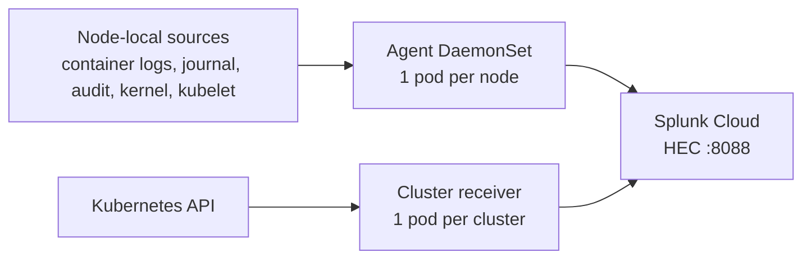

# Splunk OpenTelemetry Collector on NKP — a newcomer summary

> **How to use this file:** each `## Slide n` below is one slide. Copy the bullets straight into
> PowerPoint / Google Slides, and use the `Talk track:` line as the speaker note.
> For the full detail see [`README.md`](README.md), [`DIAGRAMS.md`](DIAGRAMS.md) and
> [`OPERATIONAL-MODE.md`](OPERATIONAL-MODE.md).

---

## Slide 1 — Why we are doing this

- Every NKP cluster already produces **logs** (containers, host, audit) and **metrics**.
- Today that data is collected by NKP's **Fluent Bit** into **Loki** (per-cluster, Grafana).
- We want the same data in **Splunk Cloud** too, with no disruption to Loki.
- Applies to **every** cluster: the management cluster and each managed cluster.

> Talk track: "This is not a replacement. It is a second delivery of the same data, so we keep what we
> have and add Splunk."

---

## Slide 2 — What we deploy

- **Splunk's own OpenTelemetry Collector** — Helm chart `splunk-otel-collector` (pinned 0.160.0).
- It installs **two workloads**:
  - an **agent DaemonSet** — one pod per node, reads **node-local** data;
  - a **cluster receiver Deployment** — one pod per cluster, reads the **Kubernetes API**.
- Installed with **plain Helm** — no NKP catalog, no AppDeployment required.

> Talk track: "Two pods *types*: one that runs everywhere to read each node, and one that runs once to
> read the cluster view."

---

## Slide 3 — How it is installed (3 steps)

1. Copy `local.env.example` to `local.env` and fill in: HEC **endpoint**, HEC **token**, the two
   **indexes**, and a unique **cluster name** (this file is gitignored — the token never lands in git).
2. `./scripts/render.sh 08-splunk-otel-helm` — substitutes your values into the Helm values.
3. `./08-splunk-otel-helm/install.sh --apply` — runs `helm repo add` + `helm upgrade --install`.
   - add `--prometheus` to also ship NKP's Prometheus metrics
   - `install.sh` with no flag is a safe **dry-run**

> Talk track: "One values file, one command. Dry-run by default, so you can always preview first."

---

## Slide 4 — Where the logs come from

| Source | What it is |
|---|---|
| container logs | stdout/stderr of every pod (`/var/log/pods/*`) |
| host journal | kubelet, sshd, systemd, **kernel** — the whole journal |
| audit files | kube-apiserver audit (`/var/log/kubernetes/audit/*.log`) |
| Kubernetes Events | cluster events |

- The collector tails the **same sources** NKP's Fluent Bit reads — it does **not** read Loki.

> Talk track: "Dual-ship: both tools read the same files. Nothing is chained, nothing is duplicated
> inside the collector."

---

## Slide 5 — Where the metrics come from (it *pulls* them)

| Pulled from | Receiver | Every |
|---|---|---|
| the node kernel (`/proc`, `/sys`) | `host_metrics` | 10s |
| the **kubelet** (`https://nodeIP:10250`) | `kubelet_stats` | 10s |
| the **Kubernetes API** | `k8s_cluster` | continuous |
| the collector itself | `prometheus/agent` | 10s |
| NKP's **Prometheus** `/federate` *(optional)* | `prometheus/nkp` | 60s |

- **Pull, not push** — except OTLP, where apps can send data to the collector.

> Talk track: "Almost everything is fetched on a timer. Only applications push to it (OTLP)."

---

## Slide 6 — Where it is sent

- Everything goes over **HEC** — Splunk's HTTP Event Collector — on **port 8088**:
  `https://<stack>.splunkcloud.com:8088/services/collector/event`
- **Logs → index `k8s_logs`** · **Metrics → index `k8s_metrics`** (a metrics-type index).
- The token authenticates; the chart stores it in a **Kubernetes Secret**.
- Delivery is resilient: an internal **queue** + **retry** absorb short outages.

> Talk track: "One door (HEC), two buckets (indexes). Logs and metrics must not share an index."

---

## Slide 7 — The settings that matter (and why)

| Setting | Why |
|---|---|
| `clusterName` | becomes `k8s.cluster.name` — how you tell clusters apart in Splunk |
| `splunkPlatform.endpoint` | the HEC URL |
| `splunkPlatform.index` | the events index for logs — **must be allowed by the HEC token** |
| `metricsIndex` + `metricsEnabled` | metrics need a **metrics-type** index, not the logs one |
| `insecureSkipVerify: true` | Splunk Cloud's HEC certificate is not publicly trusted |
| `kubelet_stats.insecure_skip_verify: true` | the kubelet certificate has no IP SAN |
| `journald.units: []` + `journald/all` | the chart has no "all units" option, so we add a catch-all |

> Talk track: "Five of these are mandatory just to make data arrive; the last one is about *complete*
> host logs."

---

## Slide 8 — Three gotchas that bite everybody

1. **Index not allowed on the token** → Splunk answers `400 Incorrect index` and the collector
   **silently drops everything** (pods still look healthy).
2. **Token changed but pods not restarted** → `403 Forbidden`; the token is an env var, so
   `kubectl rollout restart ds/...`.
3. **kubelet certificate has no IP SAN** → **0 metrics and no errors**; needs
   `insecure_skip_verify: true`.

> Talk track: "If it looks broken, it is almost always one of these three. 'No drops' does not mean
> healthy — check the per-receiver counters."

---

## Slide 9 — How we know it works

- `kubectl -n splunk-otel get ds,deploy` → agent **7/7**, cluster receiver **1/1**.
- `kubectl -n splunk-otel logs -l app=splunk-otel-collector | grep -c 'Dropping data'` → **0**.
- Per-receiver counters (port-forward `:8889` / `:8899`):
  `otelcol_receiver_accepted_log_records` / `_metric_points` must be **growing**.
- In the Splunk UI:
  `index=k8s_logs | stats count by k8s.cluster.name`
  `| mcatalog values(metric_name) WHERE index=k8s_metrics`

> Talk track: "Two questions catch almost everything: are the pods ready, and are the counters
> growing?"

---

## Slide 10 — Recap

- **Pull** on a timer from nodes + the Kubernetes API; **send** over HEC.
- **Two workloads**: agent (per node) + cluster receiver (per cluster).
- **Two indexes**: `k8s_logs` and `k8s_metrics`.
- **One Helm release**, one values file, one command.
- **Loki is untouched** — this is a parallel path, not a migration.
- Optional: `--prometheus` federates everything NKP's Prometheus already scraped.

> Talk track: "One picture to remember: pull on a timer, ship over HEC, two indexes, Loki unchanged."

---

## Slide 11 — Where to read more

- [`README.md`](README.md) — the step-by-step lab (install, verify, troubleshooting matrix).
- [`DIAGRAMS.md`](DIAGRAMS.md) — the same story as diagrams.
- [`OPERATIONAL-MODE.md`](OPERATIONAL-MODE.md) — the deep dive: every receiver, timer, auth and port.
- [`values.example.yaml`](values.example.yaml) — every setting with WHAT / DEFAULT / OURS / WHY / BREAKS.
