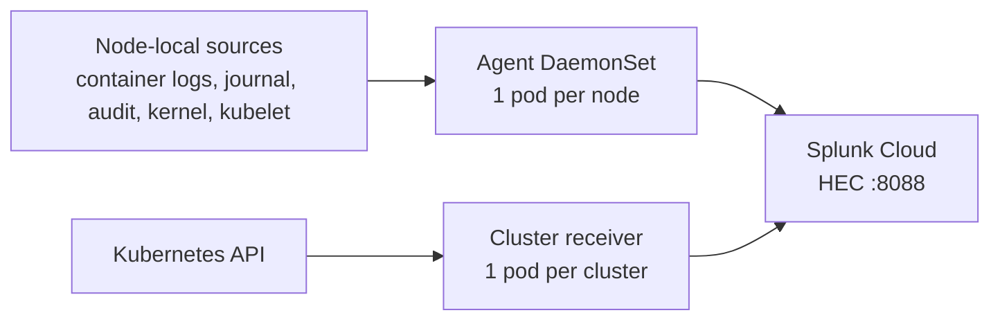

# Splunk OpenTelemetry Collector on NKP — a summary

A short, plain-language summary for someone who has never seen this setup. For the full detail see
[`README.md`](README.md), [`DIAGRAMS.md`](DIAGRAMS.md) and [`OPERATIONAL-MODE.md`](OPERATIONAL-MODE.md).

---

## Why we are doing this

- Every NKP cluster already produces **logs** (containers, host, audit) and **metrics**.
- Today that data is collected by NKP's **Fluent Bit** into **Loki** (per-cluster, for Grafana).
- We also want the same data in **Splunk Cloud**, with **no disruption** to Loki.
- This applies to **every** cluster: the management cluster and each managed cluster.

This is not a replacement. It is a **second delivery of the same data** — we keep what we have and add
Splunk.

---

## What we deploy

- **Splunk's own OpenTelemetry Collector** — Helm chart `splunk-otel-collector` (pinned version).
- It installs **two workloads**:
  - an **agent DaemonSet** — one pod per node, reading **node-local** data;
  - a **cluster receiver Deployment** — one pod per cluster, reading the **Kubernetes API**.
- Installed with **plain Helm** — no NKP catalog and no AppDeployment required.

---

## How it is installed

1. Copy `local.env.example` to `local.env` and fill in the HEC **endpoint**, the HEC **token**, the
   two **indexes**, and a unique **cluster name**. This file is gitignored — the token never lands in git.
2. `./scripts/render.sh 08-splunk-otel-helm` — substitutes those values into the Helm values.
3. `./08-splunk-otel-helm/install.sh --apply` — runs `helm repo add` and `helm upgrade --install`.

Notes:

- running `install.sh` with no flag is a safe **dry-run** (it only renders the chart);
- add `--prometheus` to also ship the metrics NKP's Prometheus has already scraped.

---

## Where the logs come from

| Source | What it is |
|---|---|
| container logs | stdout/stderr of every pod (`/var/log/pods/*`) |
| host journal | kubelet, sshd, systemd, **and the kernel** — the whole journal |
| audit files | kube-apiserver audit (`/var/log/kubernetes/audit/*.log`) |
| Kubernetes Events | cluster events from the API |

The collector tails the **same sources** NKP's Fluent Bit reads; it never reads Loki. Both tools read
the same files in parallel (dual-ship), so nothing is chained and nothing is duplicated inside the
collector.

---

## Where the metrics come from (it *pulls* them)

| Pulled from | Receiver | Every |
|---|---|---|
| the node kernel (`/proc`, `/sys`) | `host_metrics` | 10s |
| the **kubelet** (`https://<nodeIP>:10250`) | `kubelet_stats` | 10s |
| the **Kubernetes API** | `k8s_cluster` | continuous |
| the collector itself | `prometheus/agent` | 10s |
| NKP's **Prometheus** `/federate` *(optional)* | `prometheus/nkp` | 60s |

It is **pull, not push** — except OTLP, where applications can send data to the collector themselves.

---

## Where it is sent

- Everything goes over **HEC** — Splunk's HTTP Event Collector — on **port 8088**:
  `https://<your-stack>.splunkcloud.com:8088/services/collector/event`
- **Logs go to the events index `k8s_logs`**; **metrics go to the metrics index `k8s_metrics`**.
- The HEC token authenticates every request; the chart stores it in a **Kubernetes Secret**.
- Delivery is resilient: an internal **queue** plus **retry** absorb short HEC outages.

Logs and metrics must never share an index: an events index cannot hold metrics.

---

## The settings that matter (and why)

| Setting | Why |
|---|---|
| `clusterName` | becomes `k8s.cluster.name` — how you tell clusters apart in Splunk |
| `splunkPlatform.endpoint` | the HEC URL |
| `splunkPlatform.index` | the events index for logs — **must be allowed by the HEC token** |
| `metricsIndex` + `metricsEnabled` | metrics need a **metrics-type** index, not the logs one |
| `insecureSkipVerify: true` | the Splunk Cloud HEC certificate is not publicly trusted |
| `kubelet_stats.insecure_skip_verify: true` | the kubelet certificate has no IP SAN |
| `journald.units: []` + `journald/all` | the chart has no "all units" option, so we add a catch-all receiver |

Most of these are mandatory simply for data to arrive; the last one is about **complete** host logs.

---

## Three gotchas that bite everybody

1. **Index not allowed on the token** — Splunk answers `400 Incorrect index` and the collector
   **silently drops everything** while the pods still look healthy.
2. **Token changed but pods not restarted** — you get `403 Forbidden`; the token is an environment
   variable, so the DaemonSet needs a restart to pick up the new value.
3. **kubelet certificate has no IP SAN** — you get **0 metrics and no errors**; it needs
   `insecure_skip_verify: true`.

If it looks broken, it is almost always one of these three. And remember: **"no drops" does not mean
healthy** — a receiver that fails to scrape produces nothing and drops nothing, so check the
per-receiver counters.

---

## How we know it works

- `kubectl -n splunk-otel get ds,deploy` — the agent should be ready on every node and the cluster
  receiver 1/1.
- `kubectl -n splunk-otel logs -l app=splunk-otel-collector | grep -c 'Dropping data'` — should be **0**.
- The per-receiver counters (`otelcol_receiver_accepted_log_records` /
  `otelcol_receiver_accepted_metric_points`) should be **growing**.
- In the Splunk UI:
  - `index=k8s_logs | stats count by k8s.cluster.name`
  - `| mcatalog values(metric_name) WHERE index=k8s_metrics`

Two questions catch almost everything: are the pods ready, and are the counters growing?

---

## Recap

- **Pull** on a timer from the nodes and the Kubernetes API; **send** over HEC.
- **Two workloads**: agent (per node) and cluster receiver (per cluster).
- **Two indexes**: `k8s_logs` for logs and `k8s_metrics` for metrics.
- **One Helm release**, one values file, one command.
- **Loki is untouched** — this is a parallel path, not a migration.
- Optional: `--prometheus` federates everything NKP's Prometheus has already scraped.

One picture to remember: **pull on a timer → ship over HEC → two indexes → Loki unchanged.**

---

## Where to read more

- [`README.md`](README.md) — the step-by-step lab: install, verify, and a troubleshooting matrix.
- [`DIAGRAMS.md`](DIAGRAMS.md) — the same story as diagrams.
- [`OPERATIONAL-MODE.md`](OPERATIONAL-MODE.md) — the deep dive: every receiver, its target, timer, auth
  and port.
- [`values.example.yaml`](values.example.yaml) — every setting with WHAT / DEFAULT / OURS / WHY / BREAKS.
