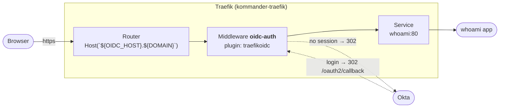

# Lab 09 — protect an app with Okta OIDC (the **Traefik OIDC plugin**)

**Learn:** put an application behind **OpenID Connect (OIDC)** authentication using a
**Traefik plugin middleware** — no sidecar, no oauth2-proxy, no Dex. Traefik itself talks
to **Okta**, holds the browser session, and forwards the signed-in identity to the app.



The three things Traefik (not the app) owns: the **session**, the **redirect to Okta**, and
the **identity headers** (`X-Forwarded-User`, `X-User-Groups`, …) it adds before forwarding.

**Who runs this lab:** someone with an **Okta tenant** (a free Developer org is fine) and
`kubectl` access to a cluster whose ingress is **Traefik** (NKP: `kommander-traefik`).

> **Hands-on, step by step.** Every step is its own page, and shows the **manifest**, the
> **raw command**, the **expected output** and the **gotchas**. Prefer to paste by hand —
> go ahead, nothing is hidden behind a script. `scripts/*.sh` are optional shortcuts.
>
> **Validated end to end** on a Traefik v3.6 / NKP-managed cluster: an anonymous request
> returned **`302` to the IdP** with the plugin's encrypted session cookies set and Traefik
> fetching OIDC discovery — proving the plugin loaded and `urn:k8s:secret:` resolved.

---

## Step index

| # | Step | What you do |
|---|---|---|
| 01 | [Prerequisites](steps/01-prereqs.md) | `kubectl`, ingress class, DNS + TLS for the app host, `local.env` |
| 02 | [Create the Okta OIDC app](steps/02-okta-setup.md) | app + redirect URI + groups claim; collect issuer/client id/secret |
| 03 | [Enable the Traefik plugin](steps/03-enable-traefik-plugin.md) | override the `traefik` AppDeployment with `experimental.plugins` |
| 04 | [Create the Secret](steps/04-create-secret.md) | client secret + session key in a Kubernetes Secret |
| 05 | [Deploy the demo app](steps/05-deploy-demo-app.md) | a `whoami` that echoes the injected identity |
| 06 | [Create the Middleware](steps/06-create-middleware.md) | `Middleware` → `spec.plugin.traefikoidc` |
| 07 | [Create the protected IngressRoute](steps/07-protected-ingressroute.md) | attach the Middleware to the host |
| 08 | [Test the flow](steps/08-test-the-flow.md) | 302 → Okta → login → 200 + `X-Forwarded-User` |
| 09 | [Troubleshooting](steps/09-troubleshooting.md) | plugin not loaded, 404, loops, 431, certs… |
| 10 | [Cleanup](steps/10-cleanup.md) | delete route → middleware → app → secret (→ revert plugin) |

---

## Files (manifests = the source of truth)

| File | Kubernetes object | Step |
|---|---|---|
| `namespace.yaml` | Namespace `${NAMESPACE}` | 05 |
| `app/deployment.yaml` · `app/service.yaml` | Deployment + Service `whoami` | 05 |
| `oidc/secret.example.yaml` | Secret `okta-oidc` (COPY it — never commit) | 04 |
| `oidc/middleware.yaml` | `Middleware` `oidc-auth` (the plugin config) | 06 |
| `ingressroute/ingressroute.yaml` | `IngressRoute` `whoami` (protected) | 07 |
| `traefik-plugin/overrides.example.yaml` | ConfigMap override for the `traefik` AppDeployment | 03 |
| `scripts/enable-plugin.sh` · `install.sh` · `verify.sh` · `uninstall.sh` | optional shortcuts | 03–10 |

---

## Quick run (optional — the README/steps are the real lab)

```bash
cp local.env.example local.env      # gitignored; fill in your values (see below)
$EDITOR local.env

# 03 — enable the plugin (restarts Traefik; brief NKP-UI blip)
./09-traefik-oidc-okta/scripts/enable-plugin.sh --apply

# 02 — do this in the Okta console first (see steps/02-okta-setup.md)

# 04-07 — deploy secret + app + middleware + route
./09-traefik-oidc-okta/scripts/install.sh --apply

# 08 — verify
./09-traefik-oidc-okta/scripts/verify.sh
```

---

## Variables (`local.env`)

| Variable | Meaning | Example |
|---|---|---|
| `OIDC_HOST` | hostname label → app at `${OIDC_HOST}.${DOMAIN}` | `whoami` |
| `OIDC_PLUGIN_VERSION` | Git ref/version of the `traefikoidc` plugin | `v1.0.36` |
| `TRAEFIK_NS` | namespace where Traefik runs (plugin secret / AppDeployment) | `kommander` |
| `OKTA_ISSUER` | OIDC issuer URL (matches token `iss`) | `https://<org>.okta.com` |
| `OKTA_CLIENT_ID` | Okta app **Client ID** | `<client-id>` |
| `OKTA_CLIENT_SECRET` | Okta app **Client Secret** (**secret**) | `<client-secret>` |
| `OIDC_SESSION_KEY` | cookie encryption key, **≥ 32 bytes** (**secret**) | `openssl rand -base64 32` |
| `OIDC_ALLOWED_DOMAINS` | email domain(s) allowed | `example.com` |
| `OIDC_ALLOWED_GROUPS` | optional Okta group(s) allowed (needs a `groups` claim) | `My-App-Users` |

> **Two secrets** (`OKTA_CLIENT_SECRET`, `OIDC_SESSION_KEY`) live **only** in the gitignored
> `local.env` and the Kubernetes Secret. They are rendered into `rendered/` (also gitignored)
> and never committed.

---

## Requirements

- `kubectl` pointing at a cluster with **Traefik** as ingress (NKP: `kommander-traefik`).
- **DNS**: `${OIDC_HOST}.${DOMAIN}` must resolve to the ingress LoadBalancer; a **wildcard**
  (`*.apps.<cluster>.<domain>`) or a TLS cert whose SANs include the host.
- **An Okta tenant** (Developer/Preview org works) and the right to create an app there.
- **Internet egress from the Traefik pod** so it can download the plugin at startup
  (air-gapped? see [step 03](steps/03-enable-traefik-plugin.md) → `localPlugins`).

## How this differs from the alternatives

- **vs. forward-auth + oauth2-proxy** (the classic pattern): here the OIDC logic is a
  **Traefik plugin**, so there is no extra Deployment/Service, no separate session store,
  and the identity headers are produced by Traefik itself.
- **vs. NKP's built-in `traefik-forward-auth`**: that protects the **NKP UI** using the
  platform Dex; this lab is **app-scoped** and points at **your** IdP (Okta).

See the [appendix in step 07](steps/07-protected-ingressroute.md#appendix-the-other-two-patterns)
for a side-by-side.

## Cleanup

```bash
./09-traefik-oidc-okta/scripts/uninstall.sh            # app + secret + middleware + route
./09-traefik-oidc-okta/scripts/uninstall.sh --plugin   # + revert the Traefik override
```
