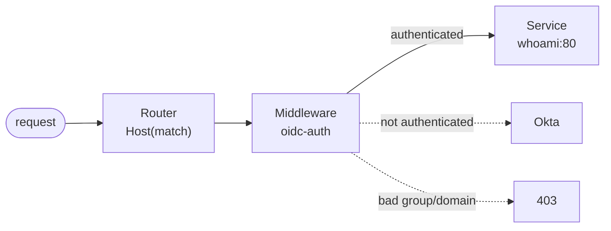
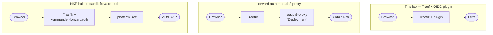

# Step 07 — Create the protected IngressRoute

`[◀ Step 06](06-create-middleware.md)` · `[README](../README.md)` · `[Step 08 ▶](08-test-the-flow.md)`

## Goal
Publish the app on a hostname and **attach the `oidc-auth` Middleware** so every request
must authenticate first.

## Why it matters
This is where auth is *enforced*. The one trace to get wrong: the Middleware must be in the
**same namespace** as this route (Traefik's CRD provider defaults to
`allowCrossNamespace: false`) — otherwise the reference is ignored and the route ends up
**unauthenticated**.

## The manifest
`ingressroute/ingressroute.yaml`:
```yaml
apiVersion: traefik.io/v1alpha1
kind: IngressRoute
metadata:
  name: whoami
  namespace: ${NAMESPACE}
spec:
  entryPoints:
    - websecure
  routes:
    - match: Host(`${OIDC_HOST}.${DOMAIN}`)
      kind: Rule
      middlewares:
        - name: oidc-auth        # <-- the enforcement point
      services:
        - name: whoami
          port: 80
  tls: {}
```



- `entryPoints: [websecure]` — the TLS entrypoint (`web` only redirects to it).
- `tls: {}` — use Traefik's **default certificate** (or set `tls.secretName`).
- **No `ingressClassName`** on Traefik CRDs — Traefik always handles them.

## Apply
```bash
./scripts/render.sh 09-traefik-oidc-okta
kubectl apply -f rendered/09-traefik-oidc-okta/ingressroute/ingressroute.yaml
kubectl -n "$NS" get ingressroute whoami
```
If you already ran lab 04 for the same host, remove its plain Ingress so there is no
unauthenticated router for the host:
```bash
kubectl -n "$NS" delete ingress apache --ignore-not-found
```

## Expected output
```bash
kubectl -n "$NS" get ingressroute whoami
# NAME     AGE
# whoami   ...
```
And an unauthenticated probe should redirect:
```bash
curl -skI "https://${OIDC_HOST}.${DOMAIN}/" | grep -iE '^HTTP|^location'
# HTTP/2 302
# location: https://<org>.okta.com/oauth2/default/v1/authorize?client_id=...
```

## Gotchas
- **Same namespace** as the Middleware, or the route is silently public.
- **TLS default may not match the host.** `tls: {}` uses Traefik's default cert, which on NKP
  is often **IP-only** (`CN=traefik.localhost.localdomain`, SAN = the LoadBalancer IP) → the
  browser warns for a DNS name. If you have a wildcard Secret (e.g.
  `*.apps.<cluster>.<domain>`), reference it **in this same namespace** (TLS Secret refs are
  same-namespace only, exactly like middlewares):
  ```yaml
  tls:
    secretName: apps-default-tls
  ```
  If the wildcard lives in another namespace, either deploy the lab there or copy it:
  ```bash
  kubectl -n <cert-ns> get secret apps-default-tls -o yaml \
    | sed "s/namespace: <cert-ns>/namespace: $NS/" | kubectl -n "$NS" apply -f -
  ```
- If you see the plain **404** default backend, the `Host(...)` doesn't match the URL you
  requested (`curl` sends `https://<host>/`).
- Two routers on the same host (your protected one **plus** an old Ingress) → the bypass wins
  on some paths. Delete the old router.

## Appendix — the other two patterns



| | This lab (plugin) | forward-auth + oauth2-proxy | NKP `traefik-forward-auth` |
|---|---|---|---|
| Extra Deployment | no | **yes** (oauth2-proxy) | no (platform-provided) |
| IdP | **your** Okta | any (Okta via Dex, etc.) | platform **Dex** → AD/LDAP |
| Scope | app-scoped policy | app-scoped | NKP UI + attached clusters |
| Enable cost | Traefik static-config change | a Deployment | already installed |

Next: **[Step 08 — Test the flow ▶](08-test-the-flow.md)**
