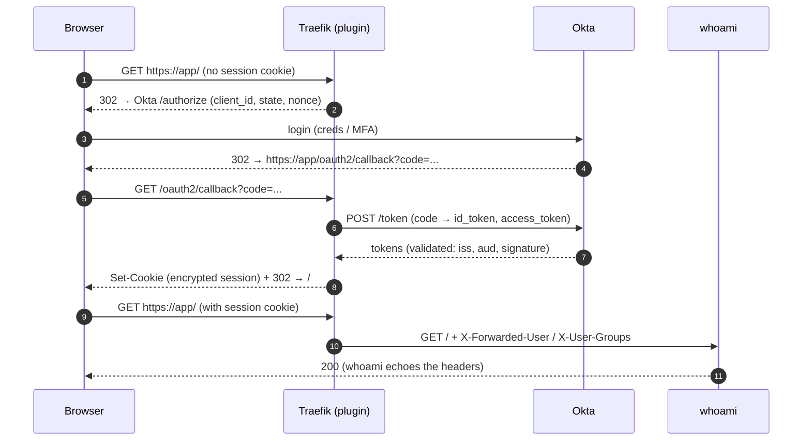

# Step 08 — Test the flow

`[◀ Step 07](07-protected-ingressroute.md)` · `[README](../README.md)` · `[Step 09 ▶](09-troubleshooting.md)`

## Goal
Prove the whole loop: an anonymous request is redirected to Okta, a real login comes back,
and the app receives the authenticated identity.

## The flow


## 1) Anonymous request → redirect (no browser needed)
```bash
curl -skI "https://${OIDC_HOST}.${DOMAIN}/" | grep -iE '^HTTP|^location'
# HTTP/2 302
# location: https://<org>.okta.com/.../authorize?client_id=...&redirect_uri=https%3A%2F%2Fapp%2Foauth2%2Fcallback&...
```

## 2) Full login (browser)
Open `https://${OIDC_HOST}.${DOMAIN}/` — you land on **Okta**, sign in, and come back to the
whoami page. It prints the headers, including:
```
X-Forwarded-User: you@example.com
X-User-Groups: ...
X-Auth-Request-Redirect: /
```

## 3) Reuse the session from the CLI
Grab the cookie the plugin set (from a browser dev-tools, or `-c/-b` with a manual login
flow) and confirm the app is reached:
```bash
curl -sk -b "cookies.txt" "https://${OIDC_HOST}.${DOMAIN}/" | grep -i 'forwarded-user'
```

## 4) One-shot check
```bash
./09-traefik-oidc-okta/scripts/verify.sh
```
It prints the objects, greps Traefik for the plugin, and probes the URL:
- **302 → Okta** = ✅ (authentication is enforced)
- **200 without a cookie** = ⚠ **unauthenticated** — see step 09 (namespace mismatch / missing plugin)

## Expected output (summary)
| Probe | Expected |
|---|---|
| `curl -kI` anonymous | `302` + `location:` to Okta `authorize` |
| Browser, not logged in | Okta login page |
| Browser, logged in | whoami page with `X-Forwarded-User` |
| `curl -kI` with a session cookie | `200` |

## Gotchas
- A redirect **loop** between app and Okta ⇒ `providerURL`/`iss` mismatch, or the callback
  URI registered in Okta differs from `https://<host>/oauth2/callback`.
- `Access denied: email domain not allowed` ⇒ `allowedUserDomains`.
- `Access denied: roles/groups` ⇒ `allowedRolesAndGroups` set but no `groups` claim.

Next: **[Step 09 — Troubleshooting ▶](09-troubleshooting.md)**
