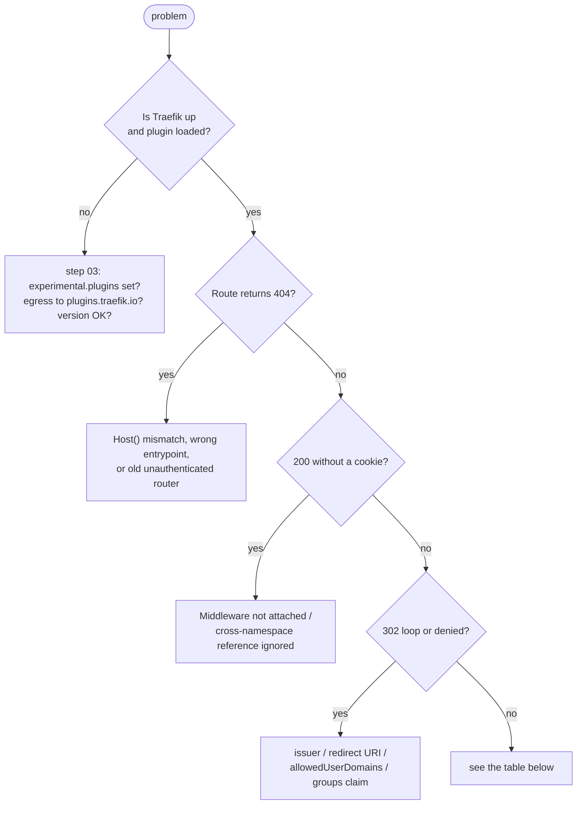

# Step 09 — Troubleshooting

`[◀ Step 08](08-test-the-flow.md)` · `[README](../README.md)` · `[Step 10 ▶](10-cleanup.md)`

## Triage first


## Symptom → cause → fix

| Symptom | Likely cause | Fix |
|---|---|---|
| Traefik pod **CrashLoopBackOff**, logs `failed to load plugin` | no egress to `plugins.traefik.io`, or a version that doesn't match the Traefik release | allow egress, fix `OIDC_PLUGIN_VERSION`, or use `localPlugins` (step 03) |
| `invalid handler type: <nil>` | plugin not enabled, bad Middleware config, or an env var whose name contains **`API`** | confirm step 03; validate config; rename env vars |
| Route returns Traefik **404** | `Host(...)` doesn't match, or you used the `web` entrypoint only | fix the `match`/`entryPoints`; `curl -H 'Host: ...'` to test |
| **200 without authentication** | Middleware not attached, or referenced **cross-namespace** (ignored) | same namespace as the route (step 07); `kubectl -n $NS describe middleware oidc-auth` |
| Redirect **loop** app ⇄ Okta | `providerURL` ≠ token `iss`, or Okta redirect URI ≠ `https://<host>/oauth2/callback` | align them exactly (no trailing slash) |
| `Access denied: Your email domain is not allowed` | `allowedUserDomains` | add your domain |
| `Access denied: no allowed roles or groups` | `allowedRolesAndGroups` set but the ID token has no `groups` | add the Okta **Groups claim** + `scopes: [groups]` (step 02/06) |
| `Session encryption key too short` | `SESSION_KEY` < 32 bytes | regenerate with `openssl rand -base64 32` |
| `x509: certificate signed by unknown authority` | IdP cert from a private CA | set `caCertPEM` / `caCertPath` on the Middleware |
| `token verification failed` | clock skew, wrong issuer, JWKS unreachable | check node time; check `providerURL`; `logLevel: debug` |
| **HTTP 431** Request Header Fields Too Large | big ID token + many cookies | `minimalHeaders: true`, and/or `stripAuthCookies: true` |
| `false positive replay detected` | multiple Traefik replicas without shared state | `disableReplayDetection: true` (or Redis for shared state) |

## Read the evidence
```bash
NS="$(grep ^NAMESPACE= local.env | cut -d= -f2)"; NS=${NS:-labs}
TRAEFIK_NS=kommander

kubectl -n "$NS" describe middleware oidc-auth          # events / validation errors
kubectl -n "$TRAEFIK_NS" logs deploy/traefik | tail -50 # plugin load + auth decisions
kubectl -n "$NS" get ingressroute whoami -o yaml        # middleware actually attached?
```

## Turn on verbose logging
Edit the Middleware and set `logLevel: debug`, then watch Traefik:
```bash
kubectl -n "$NS" patch middleware oidc-auth --type merge \
  -p '{"spec":{"plugin":{"traefikoidc":{"logLevel":"debug"}}}}'
kubectl -n "$TRAEFIK_NS" logs deploy/traefik -f | grep -i oidc
```

## Fastest sanity checks
```bash
# Is the plugin in the static config?
kubectl -n kommander get cm traefik-oidc-overrides -o yaml
kubectl -n kommander get appdeployment traefik -o jsonpath='{.spec.configOverrides}{"\n"}'
# Is the route actually protected? (an anonymous 200 is wrong)
curl -skI "https://${OIDC_HOST}.${DOMAIN}/" | head -1
```

Next: **[Step 10 — Cleanup ▶](10-cleanup.md)**
