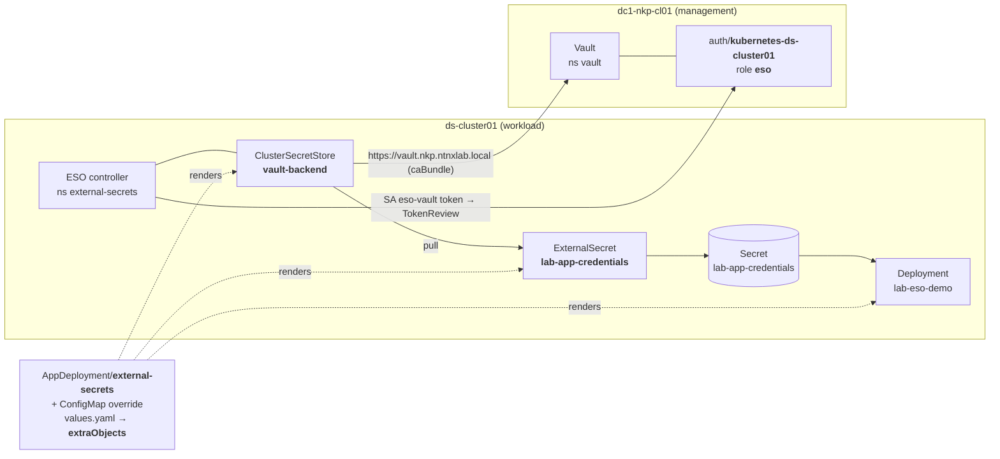

# Lab 10 — Vault + External Secrets Operator (`ClusterSecretStore` → `ExternalSecret`)

**Learn:** how to pull a secret out of **HashiCorp Vault** into a native Kubernetes Secret with the
**External Secrets Operator (ESO)**, and how to set the Vault **connection** (the "credential store")
through an **NKP `AppDeployment` override** so it is **visible and editable in the Kommander UI**.

> **NKP-specific.** ESO ships as an NKP **platform app** (`ClusterApp external-secrets-<ver>`); the
> AppDeployment/override machinery is `apps.kommander.d2iq.io`.



The three objects ESO deals with:

| Object | One-liner |
|---|---|
| **`ClusterSecretStore`** | *Where* a backend is (Vault URL, KV path) and *how to authenticate*. "The credential store." |
| **`ExternalSecret`** | *"Pull path X / key Y from that store, materialise Secret Z here, keep it in sync."* |
| **`Secret`** | The plain Kubernetes Secret ESO creates/owns — **what your app actually consumes.** |

> Diagrams (overview, override wiring, pull sequence, per-cluster auth): [`diagrams/`](diagrams/).

**Who runs this lab:** someone with `kubectl` on the NKP **management** cluster and on a **workload**
cluster, a Vault running on the management cluster, and (for the *override* path) the ESO platform app
enabled on the workload cluster.

> **Two paths to the same result — do path A.**
> - **Path A — AppDeployment override (recommended, UI-visible).** Enable ESO from the catalog and put
>   the `ClusterSecretStore`/`ExternalSecret`/demo inside the override's `extraObjects`. The store is
>   set *in the UI*. This is the "end user overrides the credential store" story.
> - **Path B — raw manifests.** Apply the CRs with `kubectl` (still valid, just not UI-driven). Kept
>   here so you can see exactly what path A renders.

---

## Step index

| # | Step | What you do |
|---|---|---|
| 01 | [Prerequisites](steps/01-prereqs.md) | two kubeconfigs, ESO app version, Vault reachability, `local.env` |
| 02 | [Teach Vault to trust ds-cluster01](steps/02-vault-remote-auth.md) | reviewer SA + a **second** `kubernetes` auth mount + role `eso` |
| 03 | [Seed the secret](steps/03-seed-vault-secret.md) | `vault kv put secret/app-credentials …` |
| 04 | [Enable ESO on the workload cluster](steps/04-enable-eso.md) | catalog → ESO → Enable → `ds-cluster01` |
| 05 | [Set the store via the AppDeployment override](steps/05-override-store.md) | the `extraObjects` override (UI + CLI) |
| 06 | [Inspect store / ExternalSecret / Secret](steps/06-inspect.md) | `Ready`, `SecretSynced`, the Kubernetes Secret |
| 07 | [Consume it in a pod](steps/07-consume.md) | env + mounted file, read the values from `logs` |
| 08 | [Change it and re-sync](steps/08-rotate.md) | edit the override / the Vault value, watch it update |
| 09 | [Troubleshooting](steps/09-troubleshooting.md) | `NotReady` store, TokenReview 403, KV path, TLS |
| 10 | [Cleanup](steps/10-cleanup.md) | revert the override → remove the glue |

---

## Files (manifests = the source of truth)

| File | Object | Step |
|---|---|---|
| `namespace.yaml` | Namespace `${NAMESPACE}` | 01 |
| `overrides/eso-overrides.example.yaml` | **ConfigMap `${ESO_OVERRIDES_CM}`** — `values.yaml` → `extraObjects` (the store + the ExternalSecret + the demo) | 05 |
| `overrides/appdeployment.example.yaml` | `AppDeployment` — installs the ESO app on `${WORKLOAD_CLUSTER}` + points at the override | 05 |
| `eso/clustersecretstore.example.yaml` | raw `ClusterSecretStore` (mirror of what the override renders) | 06 (path B) |
| `eso/externalsecret.example.yaml` | raw `ExternalSecret` | 06 (path B) |
| `app/deployment.yaml` | raw demo Deployment | 07 (path B) |
| `vault/remote-auth.md` · `vault/kv-seed.md` · `vault/validate-in-vault-ui.md` | the Vault-side glue + how to check it in the Vault UI | 02–03, validate |
| `diagrams/` | mermaid diagrams (+ standalone `.mmd`) of the whole flow, the override wiring, the pull sequence and per-cluster auth | all |
| `scripts/install.sh` · `scripts/apply-raw.sh` · `scripts/verify.sh` · `scripts/uninstall.sh` · `scripts/fetch-vault-ca.sh` · `scripts/vault-remote-auth.sh` | optional shortcuts | 02–10 |

---

## Quick run (optional — the steps are the real lab)

```bash
cp local.env.example local.env          # gitignored; fill in the Lab 10 block
./10-vault-eso/scripts/fetch-vault-ca.sh          # fills VAULT_CA_BUNDLE from the live endpoint

./10-vault-eso/scripts/vault-remote-auth.sh       # dry-run: prints the glue commands
./10-vault-eso/scripts/vault-remote-auth.sh --apply

./10-vault-eso/scripts/install.sh                 # dry-run (path A)
./10-vault-eso/scripts/install.sh --apply         # ns + override CM + AppDeployment
./10-vault-eso/scripts/verify.sh
```

---

## Variables (`local.env`)

| Variable | Meaning | Example |
|---|---|---|
| `WORKLOAD_CLUSTER` | the managed cluster to deploy to | `ds-cluster01` |
| `WORKSPACE_NS` | that cluster's **workspace** namespace on the mgmt cluster (holds the AppDeployment + override) | `datascience-xmfnz` |
| `ESO_APP_ID` / `ESO_APP_VERSION` / `ESO_CLUSTERAPP` | the ESO platform app id / version / `ClusterApp` name | `external-secrets` / `2.3.0` / `external-secrets-2.3.0` |
| `ESO_OVERRIDES_CM` | the override ConfigMap (the UI-visible field) | `external-secrets-overrides` |
| `ESO_NAMESPACE` / `ESO_SA` | where ESO runs / the SA it presents to Vault | `external-secrets` / `eso-vault` |
| `SECRETSTORE_NAME` / `EXTERNAL_SECRET_NAME` | the store / the ExternalSecret (and its target Secret) | `vault-backend` / `lab-app-credentials` |
| `VAULT_SERVER` | Vault endpoint reachable **from the workload cluster** | `https://vault.nkp.ntnxlab.local` |
| `VAULT_CA_BUNDLE` | base64 PEM of the CA that signed Vault's cert (**secret-ish**; lab gitignored) | `scripts/fetch-vault-ca.sh` |
| `VAULT_AUTH_MOUNT` / `VAULT_ROLE` | the Vault kubernetes auth mount / role | `kubernetes-ds-cluster01` / `eso` |
| `VAULT_KV_MOUNT` / `VAULT_SECRET_PATH` | KV engine mount / item path | `secret` / `app-credentials` |
| `VAULT_USERNAME` / `VAULT_PASSWORD` | the demo secret you seed in Vault | `admin` / `CHANGE-ME` |
| `DEMO_IMAGE` | image for the demo pod (needs `sh` + `sleep`) | `busybox:1.36` |

> `VAULT_CA_BUNDLE` and `VAULT_PASSWORD` are **secret-ish** — keep them only in the gitignored
> `local.env` and the rendered `rendered/` output.

---

## Validated live (2026-09-23)

Tested on the lab: Vault → ESO → Kubernetes works, and the **override → `extraObjects`** mechanism was
verified on the **management** cluster (its app delivery is healthy):

- created `ConfigMap/external-secrets-overrides` in ns `kommander` (the ESO HelmRelease lists it in
  `valuesFrom`);
- the ESO release rendered `ClusterSecretStore/vault-backend-lab10`, `ExternalSecret/lab-app-credentials`
  and `Deployment/lab-eso-demo` — all labelled `helm.toolkit.fluxcd.io/name: external-secrets`;
- `ClusterSecretStore` → `Ready=True` (`store validated`); `ExternalSecret` → `SecretSynced`;
- the pod printed `SECRET_USERNAME=admin` / `SECRET_PASSWORD=SuperSecretPassword123` (the live Vault value).

⚠ **On the workload cluster (`ds-cluster01`) the app never landed** — the workspace app-delivery pipeline
was already broken (workload `management` GitRepository pinned to an 11-day-old revision; mgmt
`git-operator` CrashLooping with `GitClaimUser … 401`). See the caveat in
[steps/04-enable-eso.md](steps/04-enable-eso.md); fix the git-operator/Flux first.

Self-validation guide (Vault UI, list secrets, read this secret): [`vault/validate-in-vault-ui.md`](vault/validate-in-vault-ui.md).

## Requirements

- **`kubectl`** access to the **management** cluster (`~/dc1-nkp-cl01.conf` on jump-01) **and** to
  `${WORKLOAD_CLUSTER}` (`~/ds-cluster01.conf`).
- A **Vault** running on the management cluster, **initialized + unsealed**, with the **KV v2** engine
  at `secret/` and its **web cert issued by your lab Root CA** (so `caBundle` can validate it).
- **ESO enabled on the workload cluster** (step 04). On NKP ≥ 2.17 it is pre-installed on the
  *management* cluster; the *workload* is where you enable it from the catalog.
- The workload cluster must be able to reach `VAULT_SERVER` (DNS + the Traefik LB) on `:443`.

---

## Why this is more than "one YAML"

- **A store is a CR, not a Helm value.** To make it *settable from the UI*, the store has to be
  **rendered by the app's chart**. The external-secrets chart's **`extraObjects`** value does exactly
  that (each entry is `tpl`-rendered as part of the release) — that is the trick this lab teaches.
- **Vault `kubernetes` auth is per-cluster.** The workload's SAs cannot be validated by a mount bound
  to the management cluster → step 02 adds a dedicated mount.
- **KV v2 path shape.** `provider.path` is the **mount**, `remoteRef.key` is the **item** — do not
  repeat the mount in the key.
- **Where the override lives.** The values are always in a **ConfigMap** (`<app>-overrides`); the
  AppDeployment only holds a *reference*. A platform-managed app may link it by convention
  (HelmRelease `valuesFrom`) with an **empty** `spec.configOverrides.name` — so the UI shows nothing
  in the AppDeployment even though the values apply. Set `configOverrides.name` +
  `clusterConfigOverrides[].configMapName` to make it visible. See
  [steps/05](steps/05-override-store.md#making-the-override-visible-in-the-appdeployment-ui).

## Reference (sibling project)

- The `nkp-deployer` **Vault runbook**: `configure/vault/` (plain-English primer
  `docs/configure/05-vault-concepts-explained.md`, runbook `docs/configure/04-vault-pki-acme.md`).
- NKP app docs: *Applications → External Secrets Operator* (enable ESO on a workload cluster).
- ESO docs: <https://external-secrets.io/> (Vault provider; `extraObjects` is a chart value).
