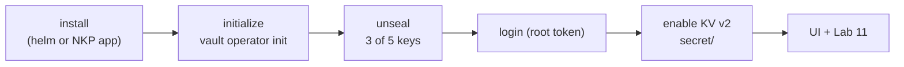

# Lab 10 — Install HashiCorp Vault (dev / standalone / HA) + init & unseal

**Learn:** what Vault is, how to install it on Kubernetes, how to **initialize and unseal** it, how to
enable a **KV v2** secrets engine, and how to reach the **UI**.

> This lab is the **prerequisite** for [Lab 11 — Vault + External Secrets Operator](../11-vault-eso/):
> there you pull secrets *out* of Vault; here you stand Vault up in the first place.



## The 3 install modes (pick one)

| Mode | Command knob | Use when |
|---|---|---|
| **dev** | `server.dev.enabled=true` | quickest throwaway test — auto-initialized+unsealed, in-memory, **root token = `root`**, no persistence |
| **standalone** | `server.standalone.enabled=true` | one Vault, persistent (Raft or file) — **simplest real install** |
| **HA (Raft)** | `server.ha.enabled=true` + `raft.enabled=true`, `replicas: 3` | production-like; unseal **each** pod |

> In this NKP lab environment Vault is provided as the **NKP catalog app `vault`** (installed the same
> `AppDeployment` way as ESO) — see [`steps/01-install.md`](steps/01-install.md#option-c--nkp-catalog-app).

## Quick run

```bash
cp local.env.example local.env            # fill the Lab 10 block
./10-vault-install/scripts/install-vault.sh            # dry-run (renders values + shows helm cmds)
./10-vault-install/scripts/install-vault.sh --apply    # helm install into ${VAULT_NAMESPACE}
./10-vault-install/scripts/init-unseal.sh              # dry-run
./10-vault-install/scripts/init-unseal.sh --apply      # init + unseal + save to Secret vault-init
```

## Steps

| # | Step | What you do |
|---|---|---|
| 01 | [Install](steps/01-install.md) | dev / standalone / HA via Helm, or the NKP catalog app |
| 02 | [Initialize + unseal](steps/02-init-unseal.md) | `vault operator init`, unseal 3/5, keep the root token |
| 03 | [KV v2 + UI](steps/03-kv-and-ui.md) | enable `secret/`, write/read a value, open the UI |
| 04 | [Teardown](steps/04-teardown.md) | uninstall cleanly |
| → | [Lab 11 — ESO](../11-vault-eso/README.md) | consume Vault secrets in Kubernetes |

## Files

| File | What |
|---|---|
| `values.example.yaml` | Helm values for a standalone Vault (UI on, ingress optional) |
| `appdeployment.example.yaml` | the NKP catalog path (`AppDeployment` for app id `vault`) — reference |
| `scripts/install-vault.sh` | render values + `helm repo add hashicorp` + `helm upgrade --install` |
| `scripts/init-unseal.sh` | run `vault operator init`, unseal the pods, store the output in `Secret/vault-init` |
| `steps/01..04` | the walk-through |

## Variables (`local.env`)

| Variable | Meaning | Example |
|---|---|---|
| `VAULT_NAMESPACE` | namespace Vault runs in | `vault` |
| `VAULT_RELEASE` | Helm release name (= the pod prefix, e.g. `<release>-0`) | `vault` |
| `VAULT_HOST` | ingress hostname for the UI/API | `vault.nkp.ntnxlab.local` |
| `VAULT_STORAGE_CLASS` | storage class for the data PVC | `nutanix-volume` |
| `VAULT_REPLICAS` | `1` = standalone, `3` = HA raft | `1` |
| `VAULT_APP_VERSION` | NKP catalog Vault app version | `0.34.1` |

## The two concepts that trip people up

- **Seal / unseal** — Vault starts **sealed** after a restart: it can't decrypt its data until enough
  unseal keys are provided. You must **unseal** it (and re-unseal after every pod restart/upgrade).
- **Init output is the keys** — `vault operator init` prints **unseal keys + a root token** **once**.
  Lose them and a Shamir-sealed Vault is unrecoverable. Store them safely (this lab puts them in
  `Secret/vault-init`; in real life use a safer store).

**Next:** [11 — pull a secret from Vault with ESO](../11-vault-eso/README.md).
