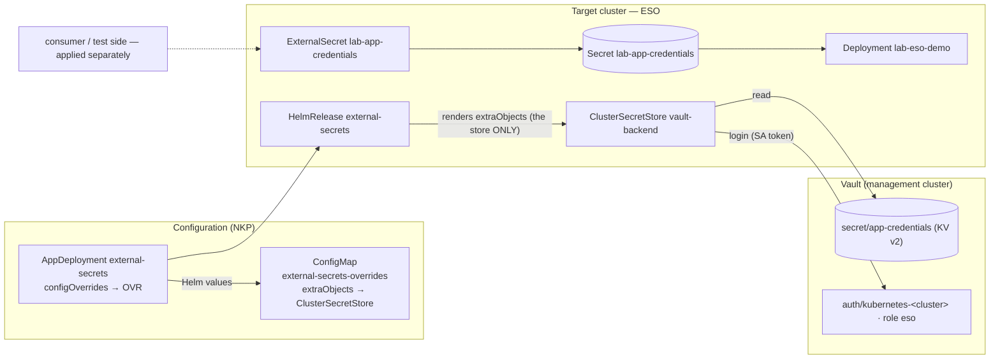
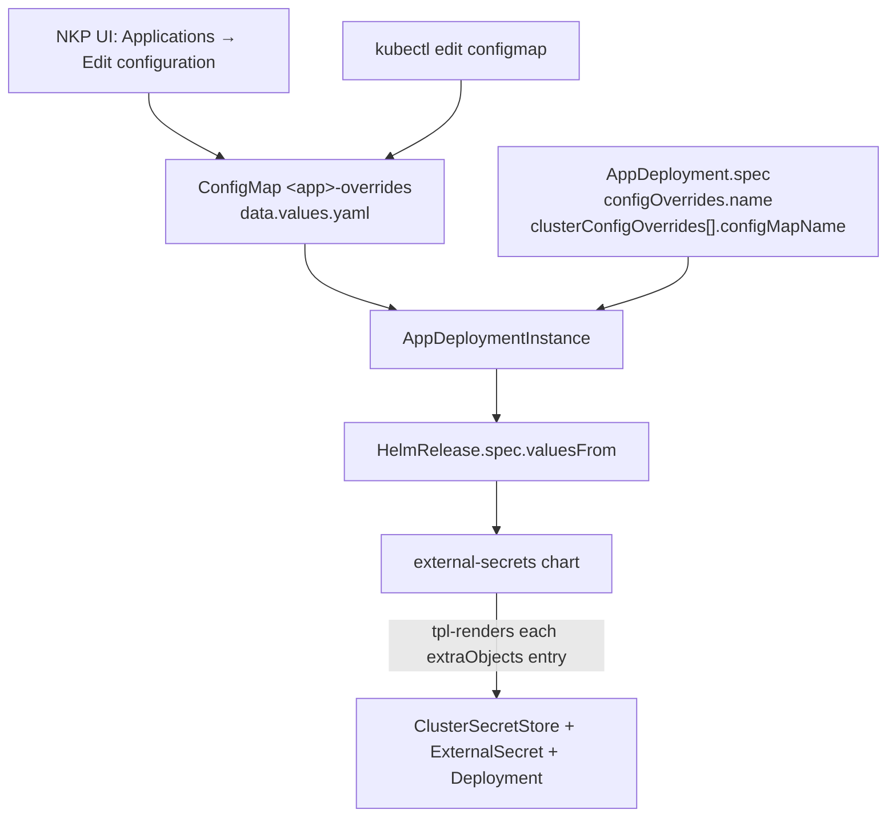
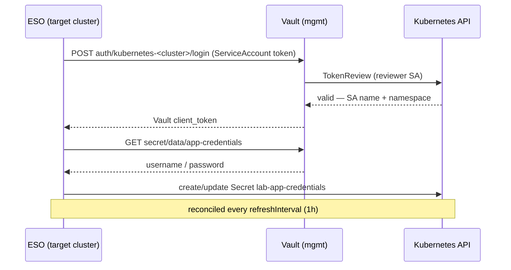
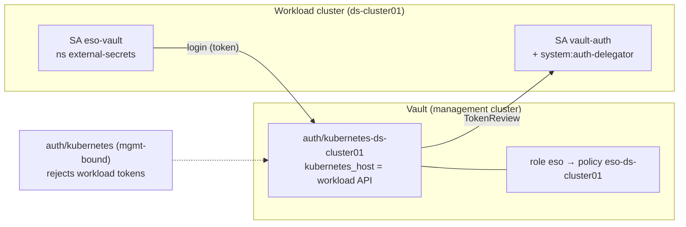

# Lab 11 — diagrams

Mermaid diagrams for "Vault → Kubernetes via the External Secrets Operator, configured by an NKP
AppDeployment override". Each diagram also exists as a standalone `.mmd` you can render/copy into a
deck:

| File | Shows |
|---|---|
| [`01-overview.mmd`](01-overview.mmd) | the whole picture: override → ESO → Vault → Secret → app |
| [`02-override-wiring.mmd`](02-override-wiring.mmd) | how a ConfigMap override becomes real objects (`extraObjects`) |
| [`03-pull-sequence.mmd`](03-pull-sequence.mmd) | the runtime secret pull (login + read) |
| [`04-auth-per-cluster.mmd`](04-auth-per-cluster.mmd) | why Vault kubernetes auth needs a mount *per cluster* |

## 01 — Overview

> The override carries **only the credential store** (`ClusterSecretStore`). The `ExternalSecret`,
> `Secret` and demo app are the **consumer/test** side — applied separately.

## 02 — How the override is wired

## 03 — Runtime: the secret pull

## 04 — Why auth is per cluster

